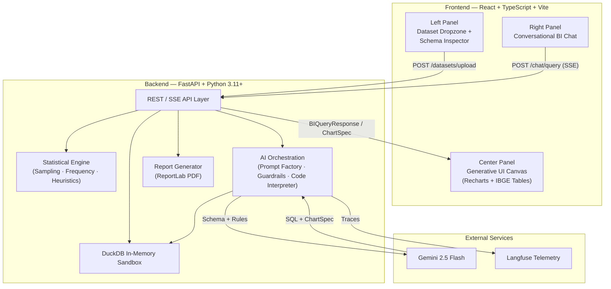

# DataMind BI

> **Converse with your raw spreadsheets, get mathematically exact answers, and auto-generate dashboards shielded against methodological errors.**

DataMind BI is a desktop-first web platform that combines **Business Intelligence**, **guided statistics**, and **conversational AI** into a single workspace. Upload a `.csv` or `.xlsx`, chat with an AI analyst backed by a local DuckDB sandbox, and receive IBGE-compliant tables, smart charts, and PDF reports — all without a single number being hallucinated.

---

## Architecture Overview



## The Four Engines

| # | Engine | Purpose |
|---|--------|---------|
| 1 | **Shielded Ingestion (DuckDB)** | Converts uploaded files into an in-memory analytical database. Raw data never leaves the server — only the schema is sent to the LLM. |
| 2 | **Conversational Analyst** | User asks a question → Gemini writes SQL → Backend executes locally → Gemini narrates the exact result. Zero AI math = zero hallucination. |
| 3 | **Methodological Shield** | IBGE/UFPA statistical rules injected into the AI prompt. The system blocks invalid chart types, forbids arithmetic on nominal variables, and enforces correct rounding. |
| 4 | **Classic Tooling (IBGE Automation)** | One-click quick actions: Frequency Distribution (Sturges), Sample Size Calculator, and IBGE-compliant PDF report generation. |

## Tech Stack

### Backend (Python 3.11+)
| Package | Role |
|---------|------|
| `fastapi` + `uvicorn` | Async web server |
| `pydantic` v2 | Domain schema validation (gatekeeper) |
| `duckdb` | In-memory analytical SQL engine |
| `openpyxl` | Excel `.xlsx` reader for DuckDB |
| `python-multipart` | Multipart file upload handling |
| `google-genai` | Google Gemini SDK (2026 official) |
| `reportlab` | Programmatic IBGE-compliant PDF generation |
| `langfuse` | LLM observability and cost tracking |
| `pytest` + `httpx` | Automated API testing |

### Frontend (TypeScript)
| Package | Role |
|---------|------|
| `vite` + `react` + `typescript` | Modern SPA framework |
| `tailwindcss` | Utility-first CSS for B2B UI |
| `react-dropzone` | Drag-and-drop file upload |
| `recharts` | Declarative chart library (dynamic rendering from AI specs) |
| `lucide-react` | Lightweight icon set |

## Project Structure

```
DataMind-BI/
├── docs/
│   ├── PRD.md                  # Product Requirements Document
│   ├── USER_STORIES.md         # User Stories with acceptance criteria
│   └── adr/
│       ├── 001-duckdb-sandbox.md
│       └── 002-ibge-heuristics.md
├── backend/
│   ├── app/
│   │   ├── main.py
│   │   ├── core/               # Config, telemetry, SQL sanitizer
│   │   ├── api/routes/         # REST + SSE endpoints
│   │   ├── models/             # Pydantic domain schemas
│   │   └── services/
│   │       ├── ai/             # Provider, prompt factory, guardrails
│   │       └── statistics/     # Heuristics, frequency, sampling
│   └── tests/
├── frontend/
│   └── src/
│       ├── components/
│       │   ├── layout/         # WorkspaceShell (3-panel)
│       │   ├── sidebar/        # Dropzone, SchemaInspector
│       │   ├── chat/           # ConversationalBI
│       │   └── canvas/         # GenerativeCanvas, charts, tables
│       └── services/           # SSE client
└── project_docs/               # Source requirements & UFPA/IBGE norms
```

## Local Development

> Setup instructions will be added as the backend and frontend are scaffolded (Commits 2 and 14).

```bash
# Backend (Commit 2+)
cd backend && pip install -e ".[dev]" && uvicorn app.main:app --reload

# Frontend (Commit 14+)
cd frontend && npm install && npm run dev
```

## Commit Plan

| Phase | Commits | Focus |
|-------|---------|-------|
| **1 — Pre-Production** | 1–4 | Docs, backend scaffold, Pydantic schemas, DuckDB ingestion |
| **2 — Statistical Engine** | 5–8 | IBGE rounding, Sturges frequency, sampling, PDF reports |
| **3 — AI Orchestration** | 9–12 | LLM provider, prompt factory, Text-to-SQL pipeline, guardrails |
| **4 — API & Frontend** | 13–16 | REST/SSE endpoints, React shell, dropzone, chat panel |
| **5 — Generative UI & Hardening** | 17–20 | Dynamic charts, IBGE tables, Langfuse telemetry, Docker |
