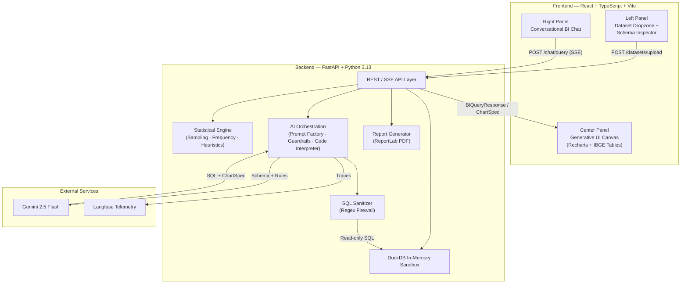
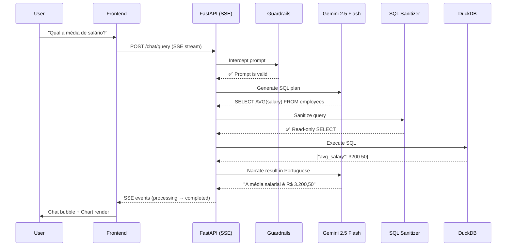

# DataMind BI

> **Converse with your raw spreadsheets, get mathematically exact answers, and auto-generate dashboards shielded against methodological errors.**

DataMind BI is a desktop-first web platform that combines **Business Intelligence**, **guided statistics**, and **conversational AI** into a single workspace. Upload a `.csv` or `.xlsx`, chat with an AI analyst backed by a local DuckDB sandbox, and receive IBGE-compliant tables, smart charts, and PDF reports — all without a single number being hallucinated.

---

## Live Architecture



## The Data Flow (Senior Code Interpreter Pattern)



## The Four Engines

| # | Engine | Purpose |
|---|--------|---------|
| 1 | **Shielded Ingestion (DuckDB)** | Converts uploaded files into an in-memory analytical database. Raw data never leaves the server — only the schema is sent to the LLM. |
| 2 | **Conversational Analyst** | User asks a question → Gemini writes SQL → Backend executes locally → Gemini narrates the exact result. Zero AI math = zero hallucination. |
| 3 | **Methodological Shield** | IBGE/UFPA statistical rules injected into the AI prompt. The system blocks invalid chart types, forbids arithmetic on nominal variables, and enforces correct rounding. |
| 4 | **Classic Tooling (IBGE Automation)** | One-click quick actions: Frequency Distribution (Sturges), Sample Size Calculator, and IBGE-compliant PDF report generation. |

## Tech Stack

### Backend (Python 3.13)
| Package | Role |
|---------|------|
| `fastapi` + `uvicorn` | Async web server with SSE streaming |
| `pydantic` v2 | Domain schema validation (gatekeeper) |
| `duckdb` | In-memory analytical SQL engine |
| `openpyxl` | Excel `.xlsx` reader for DuckDB |
| `python-multipart` | Multipart file upload handling |
| `google-genai` | Google Gemini SDK (2026 official) |
| `reportlab` | Programmatic IBGE-compliant PDF generation |
| `langfuse` | LLM observability and cost tracking |
| `pytest` + `httpx` | Automated API testing |

### Frontend (TypeScript)
| Package | Role |
|---------|------|
| `vite` + `react` + `typescript` | Modern SPA framework |
| `tailwindcss` v4 | Utility-first CSS for B2B dark-mode UI |
| `recharts` | Declarative chart library (dynamic rendering from AI specs) |
| `lucide-react` | Lightweight icon set |

## Project Structure

```
DataMind-BI/
├── docs/
│   ├── PRD.md                   # Product Requirements Document
│   ├── USER_STORIES.md          # User Stories with acceptance criteria
│   └── adr/
│       ├── 001-duckdb-sandbox.md
│       └── 002-ibge-heuristics.md
├── backend/
│   ├── Dockerfile               # Multi-stage production build
│   ├── .dockerignore
│   ├── pyproject.toml
│   ├── app/
│   │   ├── main.py
│   │   ├── core/                # Config, telemetry, SQL sanitizer
│   │   ├── api/routes/          # REST + SSE endpoints
│   │   ├── models/              # Pydantic domain schemas
│   │   └── services/
│   │       ├── ai/              # Provider, prompt factory, guardrails
│   │       │                    # code interpreter
│   │       └── statistics/      # Heuristics, frequency, sampling
│   └── tests/
├── frontend/
│   └── src/
│       ├── components/
│       │   ├── layout/          # WorkspaceShell (3-panel)
│       │   ├── sidebar/         # Dropzone, SchemaInspector
│       │   ├── chat/            # ConversationalBI
│       │   └── canvas/          # GenerativeCanvas, charts/, tables/
│       └── services/            # SSE client
└── project_docs/                # Source requirements & UFPA/IBGE norms
```

---

## Local Development

### Prerequisites

- Python 3.11+ (recommended: 3.13)
- Node.js 20+ and npm
- A Google Gemini API key (free tier works)

### 1. Backend Setup

```bash
# Clone and enter the project
git clone https://github.com/Anders0nlima/DataMind-BI.git
cd DataMind-BI/backend

# Create virtual environment
python -m venv .venv

# Activate (Windows PowerShell)
.\.venv\Scripts\Activate.ps1
# Activate (macOS / Linux)
# source .venv/bin/activate

# Install all dependencies (production + dev)
pip install -e ".[dev]"

# Create environment variables
# Copy the template and fill in your keys:
echo "GEMINI_API_KEY=your_key_here" > .env
echo "LANGFUSE_PUBLIC_KEY=" >> .env
echo "LANGFUSE_SECRET_KEY=" >> .env

# Run the test suite (all 50+ tests)
pytest -v

# Start the development server
uvicorn app.main:app --reload --port 8000
```

The API will be available at `http://localhost:8000`. Health check: `GET /health`.

### 2. Frontend Setup

```bash
cd DataMind-BI/frontend

# Install dependencies
npm install

# Start the dev server
npm run dev
```

The frontend will be available at `http://localhost:5173`.

### 3. Docker Build (Backend)

```bash
cd DataMind-BI/backend

# Build the production image
docker build -t datamind-bi-api .

# Run with environment variables
docker run -p 8000:8000 \
  -e GEMINI_API_KEY=your_key_here \
  -e LANGFUSE_PUBLIC_KEY=your_key \
  -e LANGFUSE_SECRET_KEY=your_secret \
  datamind-bi-api
```

---

## Cloud Deployment Runbook

### Backend → Render (Web Service)

| Setting | Value |
|---------|-------|
| **Repository** | `Anders0nlima/DataMind-BI` |
| **Root Directory** | `backend` |
| **Environment** | Docker |
| **Dockerfile Path** | `./Dockerfile` |
| **Instance Type** | Starter ($7/mo) or Free |
| **Health Check Path** | `/health` |

**Environment Variables (Render Dashboard):**

| Key | Value |
|-----|-------|
| `GEMINI_API_KEY` | Your Google AI Studio key |
| `LANGFUSE_PUBLIC_KEY` | (Optional) Langfuse public key |
| `LANGFUSE_SECRET_KEY` | (Optional) Langfuse secret key |
| `LANGFUSE_HOST` | `https://cloud.langfuse.com` |

**Steps:**
1. Go to [render.com](https://render.com) → New → Web Service
2. Connect your GitHub repo `Anders0nlima/DataMind-BI`
3. Set Root Directory to `backend`
4. Select "Docker" as environment
5. Add the environment variables above
6. Deploy — Render auto-builds the multi-stage Dockerfile

### Frontend → Vercel (Static Site)

| Setting | Value |
|---------|-------|
| **Repository** | `Anders0nlima/DataMind-BI` |
| **Root Directory** | `frontend` |
| **Framework Preset** | Vite |
| **Build Command** | `npm run build` |
| **Output Directory** | `dist` |

**Environment Variables (Vercel Dashboard):**

| Key | Value |
|-----|-------|
| `VITE_API_URL` | `https://your-render-service.onrender.com` |

**Steps:**
1. Go to [vercel.com](https://vercel.com) → New Project
2. Import your GitHub repo `Anders0nlima/DataMind-BI`
3. Set Root Directory to `frontend`
4. Framework Preset: **Vite**
5. Add `VITE_API_URL` pointing to your Render backend
6. Deploy — Vercel auto-builds and serves globally via CDN

> **Important:** After deploying the backend on Render, update the frontend's `sseClient.ts` to use `VITE_API_URL` instead of `http://127.0.0.1:8000` for production builds.

---

## Running Tests

```bash
cd backend

# Run all tests
pytest -v

# Run a specific module
pytest tests/test_production_safety.py -v

# Run with coverage (requires pytest-cov)
pytest --cov=app --cov-report=term-missing
```

## Commit History

| Phase | Commits | Focus |
|-------|---------|-------|
| **1 — Pre-Production** | 1–4 | Docs, backend scaffold, Pydantic schemas, DuckDB ingestion |
| **2 — Statistical Engine** | 5–8 | IBGE rounding, Sturges frequency, sampling, PDF reports |
| **3 — AI Orchestration** | 9–12 | LLM provider, prompt factory, Text-to-SQL pipeline, guardrails |
| **4 — API & Frontend** | 13–16 | REST/SSE endpoints, React shell, dropzone, chat panel |
| **5 — Generative UI & Hardening** | 17–20 | Dynamic charts, IBGE tables, Langfuse telemetry, Docker |

---

## License

This project is part of an academic portfolio. All rights reserved.
